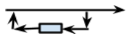
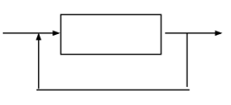

# Ejercicio 1

| **Meta símbolos usados por** |  | **Símbolo utilizado en diagramas sintácticos** | **Significado** |
| --- | --- | --- | --- |
| **BNF** | **EBNF** | --- | --- |
| palabra terminal | palabra terminal |  | Definición de un elemento terminal |
| < > | < > | rectángulo  | Definición de un elemento no terminal |
| ::= | ::= | diagrama con rectángulos, óvalos y flechas | Definición de una producción |
| | | (|) | flecha que se divide en dos o más caminos | Selección de una alternativa |
| < p > < p1 > | { } | flecha que vuelve a la condición | Repetición |
| --- | * |  | Repetición de 0 o más veces |
| --- | + |  | Repetición de 1 o más veces |
| --- | [] |  | Opcional, está presente o no lo está |